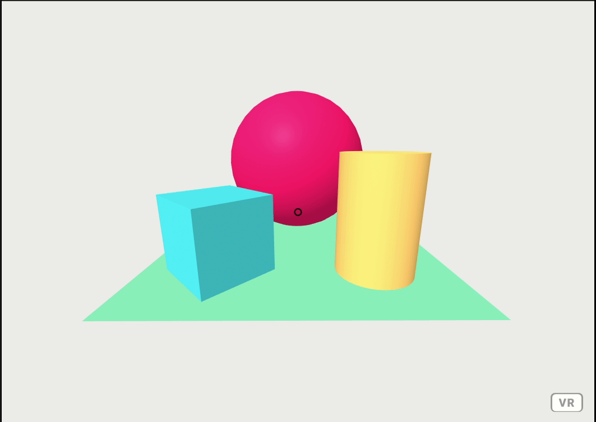

# Jump

Jump is an A-Frame component that allows a player to jump on keypress.

## Installation

Include the component file in the head of your HTML document:

```html
<script type="text/javascript" src="jump.js"></script>
```

## Usage

```html
<a-camera 
  jump="
    height: 5; 
    interval: 2000; 
    timingFunction;
  " 
>
</a-camera>
```

## Parameters

| Parameter          | Default | Description |
|--------------------|---------|-------------|
| **height**         | 5       | The height your player will jump|
| **interval**       | 1000    | The total time of the jump (in milliseconds)|
| **timingFunction** | linear  | The timing function used to control the jump.|

## Example



## Contributing
Pull requests are welcome. For major changes, please open an issue first to discuss what you would like to change.


## License
[MIT](https://choosealicense.com/licenses/mit/)
